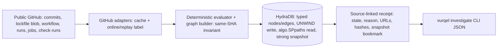

# Vurqel

Temporal supply-chain exposure proof (Track 2A). Vurqel proves which historical builds actually resolved a compromised package during its live window, down to the commit, the frozen-lockfile CI job, and the production-labelled service build, and returns a source-linked receipt backed by a graph path in HydraDB.

**Live:** https://vurqel.splitpot.xyz · **Proof:** [`proof/`](proof/) — real HydraDB output (EXPOSED path + broken-SHA refusal).

The invariant: **`EXPOSED` requires a complete same-SHA path from incident to a production build; a complete no-match is `NOT_EXPOSED`; missing or contradictory evidence is `UNPROVEN`.** Never a guess.

The refusal is the proof: break one hop's SHA and HydraDB returns **no** complete path, so the verdict falls to `UNPROVEN` — the graph will not hand back a path it cannot verify. Both outcomes are captured as real HydraDB output in [`proof/`](proof/) (EXPOSED = full 8-node path with a snapshot bookmark; broken SHA = `path: null`), reproducible in ~30 seconds each.

A real receipt for the verified case (full file: [`examples/receipts/tanstack-exposed.json`](examples/receipts/tanstack-exposed.json)):

```json
{ "state": "EXPOSED", "reasonCode": "EXPOSED_SAME_SHA_PATH",
  "commitSha": "939d3bd1b05ee09f0f4c2585a492f98da0fd066d",
  "lockfile": { "path": "tools/pnpm-lock.yaml", "contentHash": "sha256:04916898...330f6d" },
  "workflowRunId": "25698962181", "ciJob": { "name": "Build (tools)", "conclusion": "success" },
  "serviceBuild": { "provider": "cloudflare", "service": "websites-tools", "environmentLabel": "production", "checkRunId": "75454451577" },
  "snapshot": { "bookmark": "sgk:1:...:", "readEpoch": 113 }, "mode": "online" }
```

## Proof in 30 seconds

Two ways to verify the central claim without taking anything on faith:

1. **Read [`proof/`](proof/)** — real `algo.SPpaths` output captured from a live HydraDB node. `exposed/` returns the complete 8-node same-SHA path with a snapshot bookmark; `broken/` (one mismatched CI-job SHA) returns `path: null`, and the verdict falls to `UNPROVEN`.
2. **Run it** — `pnpm run hydradb:up && pnpm run investigate -- --pretty` prints the `EXPOSED` receipt; breaking a hop returns `NOT_EXPOSED` or `UNPROVEN` (see Reproduce below).

Every classification-bearing field links to a public source (see the verified-case table), so the evidence itself is independently checkable.

## Verified public case

Every row was retrieved from public sources on 2026-08-18. The same commit SHA `939d3bd1b05ee09f0f4c2585a492f98da0fd066d` joins all four artifacts.

| Evidence | Value | Source (retrieved 2026-08-18) |
|---|---|---|
| Incident window (UTC, `[from,to)`) | 2026-05-11T19:26:14Z .. 2026-05-11T22:13:38Z | [TanStack postmortem](https://tanstack.com/blog/npm-supply-chain-compromise-postmortem) / [StepSecurity advisory](https://www.stepsecurity.io/blog/mini-shai-hulud-is-back-a-self-spreading-supply-chain-attack-hits-the-npm-ecosystem) |
| Affected package | `@tanstack/react-router@1.169.8` | resolved at line 1595 of the lockfile |
| Commit (committed 2026-05-11T21:40:47Z, in window) | `939d3bd1b05e` | [commit](https://github.com/RelativeSure/websites/commit/939d3bd1b05ee09f0f4c2585a492f98da0fd066d) |
| Lockfile @ commit (sha256 `04916898...330f6d`) | `tools/pnpm-lock.yaml` | [blob](https://github.com/RelativeSure/websites/blob/939d3bd1b05ee09f0f4c2585a492f98da0fd066d/tools/pnpm-lock.yaml) |
| Workflow run (overall `failure`) | `25698962181` | [run](https://github.com/RelativeSure/websites/actions/runs/25698962181) |
| Named job (its own conclusion decides) | `Build (tools)` = `success`, frozen install | same run, job on SHA `939d3bd1` |
| Service build | `Workers Builds: websites-tools` = `success`, check `75454451577` | production-labelled build; traffic not inferred |

Claim boundary, attached to every receipt: Vurqel proves build provenance only. It does NOT prove malware execution, credential theft, or end-user traffic.

## Problem and invariant

Generic tooling answers dependency closure: "is this package present or flagged?" `npm audit` and Dependabot flag a mention; they do not prove a specific historical build installed the bad version during the hours it was live. That over-reports (every repo that ever referenced the package) or under-reports (a red CI run dismissed even though the one job that mattered went green).

Vurqel answers historical exposure: it verifies each hop on the same commit SHA and only concludes `EXPOSED` when the whole chain is present. A missing frozen install, a mismatched SHA, or unretrieved history yields `UNPROVEN`, not a false negative. This separation of absence (`NOT_EXPOSED`) from missing evidence (`UNPROVEN`) is the whole point.

## How HydraDB is load-bearing

The proof is a graph path, not an in-memory boolean. Vurqel writes typed nodes (`Incident`, `PackageVersion`, `LockfileSnapshot`, `GitCommit`, `WorkflowRun`, `CIJob`, `ServiceBuild`, `Service`) and typed edges, but only for hops the evaluator verified:

```
Incident -AFFECTS-> PackageVersion -RESOLVED_BY-> LockfileSnapshot -AT_COMMIT-> GitCommit
  -TRIGGERS-> WorkflowRun -HAS_JOB-> CIJob -PRODUCES-> ServiceBuild -TARGETS-> Service
```

Writes go through the documented HTTP client boundary as a batched `UNWIND` upsert (deterministic non-negative integer IDs, so re-ingest is idempotent):

```
UNWIND $rows AS row MERGE (n {id: row.id}) SET n:GitCommit, n.sha = row.sha, n.url = row.url
MERGE (a {id: $src})-[:AT_COMMIT]->(b {id: $dst})
```

The receipt comes from one bounded, snapshot-consistent traversal:

```
CALL algo.SPpaths({ sourceNode: <incidentId>, targetNode: <serviceId>,
  relTypes: ['AFFECTS','RESOLVED_BY','AT_COMMIT','TRIGGERS','HAS_JOB','PRODUCES','TARGETS'],
  maxLen: 8, relDirection: 'outgoing', pathCount: 1 }) YIELD path RETURN path   // consistency: strong
```

Because an edge exists only when its hop was verified, a complete Incident to Service path is returned only when the result is `EXPOSED`, and the receipt carries the snapshot bookmark and read epoch as proof of which graph state answered.

A vector store cannot answer this. The question is not "what is similar" but "does a complete typed path joined on one exact commit SHA exist in this snapshot?" Nearest-neighbor similarity cannot prove path completeness, cannot refuse on a single broken hop (`UNPROVEN`), and cannot assert a clean negative (`NOT_EXPOSED`).

## Blast radius

The same question scales from one build to many services: given a compromised package, *which of your production services actually shipped it?* `pnpm run blast-radius` runs the same graph-native path check across every candidate service and returns the **confirmed exposed set** — the services with a complete same-SHA production path — separating them from services that merely built (`NOT_EXPOSED`, e.g. staging) or that cannot be concluded (`UNPROVEN`). Real HydraDB output for an illustrative four-service scenario is in [`proof/blast-radius/result.json`](proof/blast-radius/result.json) (confirmed exposed: 2 of 4). The blast radius is which services provably shipped the bad version, not which mention the package.

Out of scope by design: ecosystem-wide reverse-dependency closure over tens of millions of versioned nodes, shared-maintainer graphs, and typosquat proximity. Vurqel trades breadth for a verdict an on-call engineer can trust and reproduce — path-completeness is the verdict, a single broken hop refuses, and it answers a question a vector store cannot.

## Architecture



## Run locally

Requirements: Node >= 22, pnpm, Docker. HydraDB is pinned by digest (`ghcr.io/hydra-db/hydradb@sha256:db78309a...cdb709`, server 0.1.0).

```bash
git clone https://github.com/mystiquemide/vurqel.git && cd vurqel
pnpm install
pnpm run hydradb:up      # clean-starts the pinned node (env: see .env.example)
pnpm run investigate -- --live --pretty   # seed + query in one command
```

`GITHUB_TOKEN` is optional (raises the anonymous 60/hour limit). Copy `.env.example` to `.env` for local settings; never commit `.env`.

## Reproduce the positive case

```bash
pnpm run investigate                 # bundled replay of the verified case
pnpm run investigate -- --live       # or fetch the same evidence from GitHub
```

Expected receipt fields: `state: EXPOSED`, `reasonCode: EXPOSED_SAME_SHA_PATH`, `commitSha 939d3bd1...`, `lockfile.contentHash sha256:04916898...`, `workflowRunId 25698962181`, `ciJob {Build (tools), success}`, `serviceBuild {cloudflare, websites-tools, production, 75454451577}`, and a `snapshot.bookmark`. Compare with [`examples/receipts/tanstack-exposed.json`](examples/receipts/tanstack-exposed.json).

## Reproduce the negative case

```bash
# Untouched / non-existent version -> NOT_EXPOSED (complete history, no match)
pnpm run investigate -- --live --repo RelativeSure/websites --lockfile tools/pnpm-lock.yaml \
  --package @tanstack/react-router --version 0.0.0-not-real \
  --from 2026-05-11T19:26:14Z --to 2026-05-11T22:13:38Z --incident-url https://tanstack.com/blog/x
```

Breaking a hop (SHA mismatch or a workflow without a frozen install) returns `UNPROVEN`, never `EXPOSED`. These paths are covered by the test suite below.

## Tests and limitations

`pnpm test` runs the pure unit tests with **no external dependencies** (evaluator branches, half-open interval and case-insensitive SHA, lockfile resolved/truncated-version parsing, receipt construction). The HydraDB + live/cached-GitHub integration suite — SHA-mismatch and missing-frozen-install `UNPROVEN`, non-production and no-resolution `NOT_EXPOSED`, duplicate-ingest idempotency, the named-job-over-red-run rule, a live-equals-fixture parity check, and the blast-radius fan-out — runs with `pnpm run hydradb:up && pnpm run test:integration` (or `pnpm run test:all` for both; 40 tests, 0 skipped). `pnpm run typecheck` is strict; there are zero runtime dependencies.

Limitations: unaudited hackathon build; one incident fully wired end to end (other public repos need explicit manifest selectors `--job`/`--service-check`/`--service`/`--env`); named job and check-run are selected by explicit name, not inferred; HydraDB's local object store cannot update flushed objects, so `hydradb:up` clean-starts each run (durable persistence needs an S3-compatible store); anonymous GitHub is 60/hour (cached, or set `GITHUB_TOKEN`); CLI-first, plus an editorial landing site in [`site/`](site/) that runs the same invariant client-side (an explainer, not a hosted HydraDB endpoint).

Assumptions: the `production` environment label comes from the explicit service selector (`--service-check`/`--env`) corroborated by the named check-run — it is not fetched from a deployment API, so treat it as declared. Frozen-install is detected from the workflow file text (there are zero runtime dependencies, so no per-job YAML parse); for an arbitrary repo, confirm the directive runs in the selected job. The verdict is computed by the deterministic evaluator and the HydraDB path read is a fail-closed check, so a shared or persistent graph cannot change a verdict; the local demo clean-starts each run.

## Attribution and license

- HydraDB (`hydra-db/hydradb`, AGPL-3.0) - the graph database that performs the load-bearing write and snapshot-scoped path read.
- Incident sources - TanStack npm supply-chain postmortem and the StepSecurity advisory (linked above).
- GitHub REST API and raw content - commit, lockfile, workflow, run, job, and check-run evidence.
- Project license: **MIT** (see [`LICENSE`](LICENSE)). HydraDB is AGPL-3.0 and is used only as a separate networked service over its HTTP API, so its copyleft does not extend to Vurqel's own source.
